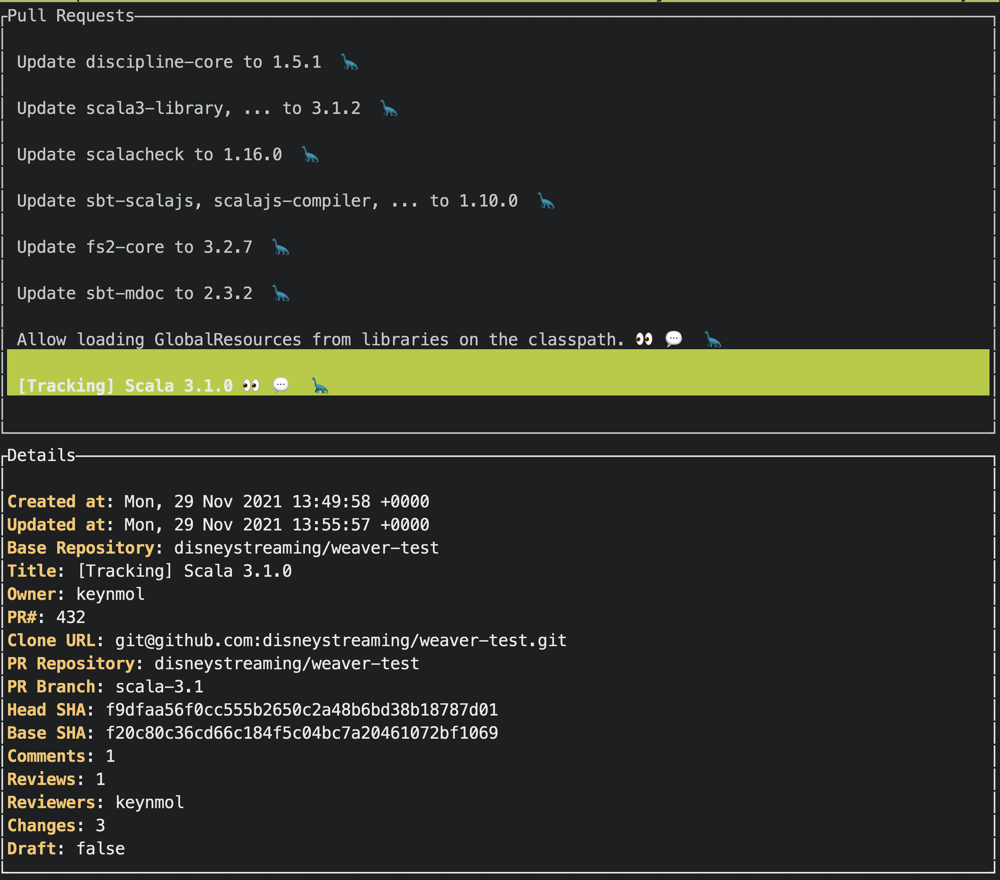

# Purs

Checkout Pull Requests with ease

## Installation

## Downloading a Release

1. Download the latest [release](https://github.com/ssanj/purs/releases) for your operating system (linux or macos).
2. Make it executable with:

```
chmod +x <PURS_EXEC>
```

3. Copy executable to a directory on your path.

### Macos Monterey (12.x) and beyond

In the later versions of macos, you can't just download and run an executable. Macos will complained that it hasn't been signed and won't allow you to open it.

To get around this you can override this behaviour under under **System Preferences** > **Security & Privacy**. Select **App Store and identified developers** under allowed apps. If you ran `purs` and it was blocked, it should be listed here now. Chose to allow purs.

If you don't want to do any of this jugglery (and who would blame you?), build `purs` from source.

### Building from Source

Ensure you have [Cargo](https://doc.rust-lang.org/cargo/getting-started/installation.html) and Rust installed.

Run:

```
cargo build --release
```

Copy binary file from `target/release/purs` to a directory on your path.

## Usage

### Create A GitHub Personal Token
You need to generate a GitHub Personal Token to use `purs`. You create one as described in the [GitHub Docs](https://docs.github.com/en/enterprise-server@3.5/authentication/keeping-your-account-and-data-secure/creating-a-personal-access-token).

The following scopes are required:

- [x] **repo** (all settings)


### Assign GitHub Personal Token to Private Org (if applicable)

If the repository you want to query is part of a private organisation, ensure your GitHub Personal Token is assigned to that organisation as well.


### Supply GitHub Personal Token

You should export your GitHub Personal Token via the `GH_ACCESS_TOKEN` environment variable or supply it to `purs` via the `-t` option.


<hr/>

### Running

To list the open pull request in a repository use:

```
purs --repo owner1/repo1
```


This will display a list of up to twenty open pull requests from the repository supplied.



You can then use the **arrow keys** to select from the list and press **enter** to choose a pull request. If you want to quit you can press **q**.

The pull request summary line has some emojis which help in quickly showing you which ones to consider.

| Emoji | Meaning |
|-------|---------|
| 👀 | PR has at least one review |
| 💬 | PR has at least one comment |
| 🔧 | PR is in **draft** |
| 🦕 | PR is older than a week |
| ✅ | PR has an approval. Has one ✅ per approval |
| 🐕 | PR has at 11 - 20 changed files |
| 🐘 | PR has at 21 - 40 changed files |
| 🐳 | PR has more than 40 changed files |


If you make a selection, `purs` will then do the following:

- The PR branch will be cloned into a directory under your PURS_HOME directory. This defaults to `~/.purs` in the following format:

`PURS_HOME/repo_owner/repository/branch_name/pr_number/branch_HEAD_hash`

- A diff file will be created with names of all the files that have changed from the parent branch. The files changed will created in a Git diff format with the same name as the original file but with an additional `.diff` suffix.

For example if the `README.md` file was updated, the diff file would be named `README.md.diff`

- A comment file will be created for each file that has review comments associated with it. It will have the same name as the original file but with an additional `.comment` suffix. This will be a JSON file. You can choose to render this information how you see fit. If you use [Sublime Text](https://www.sublimetext.com/), see below for information on a plugin that already does this for you.

You can also supply multiple repositories along with a script to execute once the chosen pull request has been cloned and diffed.

If a script will specified it will be called with two parameters:
1. The directory the pull request was checked out to
1. The name of the diff file that holds the changed file names

#### Example Script

```bash
#!/bin/bash

echo "param1: $1"
echo "param2: $2"

# Do some cool stuff here...
```

#### Sublime Text

If you use Sublime Text, you can install the [Ghomments plugin](https://github.com/ssanj/ghomments) to display the comments inline on the original file.


A complete list of options can be found with:

```
purs --help
```

which yields:

```
purs 0.3.8
Sanj Sahayam
List and checkout open Pull Requests on a GitHub repository

USAGE:
    purs [OPTIONS] --repo <repo>

OPTIONS:
    -h, --help
            Print help information

    -r, --repo <repo>
            one or more GitHub repositories to include in the form: <owner>/<repo>

    -s, --script <script>
            Optional script to run after cloning repository
            Parameters to script:
            param1: checkout directory for the selected PR
            param2: name of the file that has the names of all the changed files

            Eg. purs --repo owner/repo --script path/to/your/script

    -t, --token <gh_token>
            GitHub Access Token. Can also be supplied through the GH_ACCESS_TOKEN environment
            variable

    -V, --version
            Print version information

    -w, --wd <working_dir>
            Optional working directory. Defaults to USER_HOME/.purs
```
